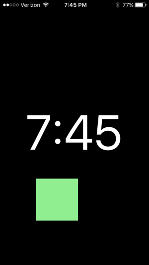

# boxy-brown

### A htm5l+css3+javascript screensaver-type iPhone app 

This screensaver-type app is just a bouncy box and a clock. I put it on
my dock and leave it on while I sleep (like an alarm clock). The speed,
color, and size of the box can be controlled via settings system that
was build by hand to mimic iOS-style settings/preference UI controls.
The background color, the color of the clock, and whether the clock is
visible are permitted customizations, as well.

This is just a fairly simple html5+css3+javascript app that I wrote
just to practice with mobile phone development and to learn best
practices (e.g. how to structure javascript projects properly, etc...).

Although it doesn't need to be, this app was developed for the primary
purpose of being (a) visited by an iOS device, (b) added to the home screen,
and (c) used as if it were a native app.

